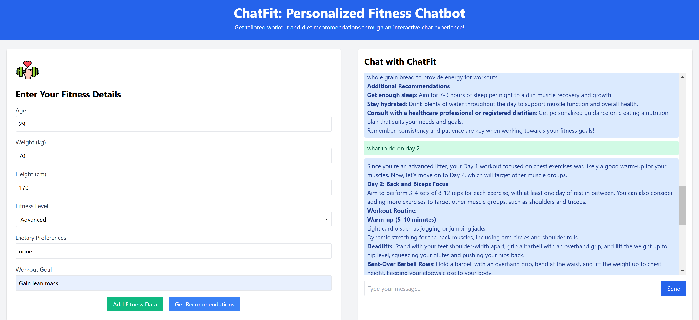

# ChatFit: Personalized Fitness Chatbot 💪💬

ChatFit is an AI-powered chatbot that provides **personalized workout and diet recommendations** based on user inputs. Built using **React (Frontend)** and **FastAPI (Backend)**, it leverages **LLM** to generate fitness advice.

## 🚀 Features
- 💬 **Interactive Chat Interface**: Get fitness-related responses in real-time.
- 🏈 **Personalized Recommendations**: Tailored workout and diet plans based on fitness data.
- 🔄 **Persistent Chat History**: Stores user messages and allows viewing past conversations.

## 📸 App Screenshot


---

## 🛠️ Tech Stack
| Component  | Technology |
|------------|------------|
| Frontend  | React, Tailwind CSS, React Markdown |
| Backend  | FastAPI, Ollama LLM |
| Deployment  | Uvicorn (for API) |

---

## ⚡ Installation

### **1️⃣ Clone the Repository**
```sh
git clone https://github.com/sabdulrahman/ChatFit.git
cd ChatFit
```

### **2️⃣ Backend Setup (FastAPI)**
> **Requirements**: Python 3.8+, FastAPI, Uvicorn, Ollama

```sh
cd backend
pip install -r requirements.txt
uvicorn main:app --reload
```

By default, the API runs on:  
📍 `http://localhost:8000`

### **3️⃣ Frontend Setup (React)**
> **Requirements**: Node.js 16+

```sh
cd frontend
npm install
npm run dev  # If using Vite
npm start    # If using Create React App
```

By default, the frontend runs on:  
📍 `http://localhost:3000`

---

## 💼 API Endpoints

| Method | Endpoint | Description |
|--------|---------|-------------|
| `POST` | `/get-recommendations` | Generates a **personalized workout and diet plan** based on the provided fitness data. |
| `POST` | `/chat` | Handles **free-text chat queries**. If fitness data is available, it is sent to the LLM for better responses. |
| `GET` | `/chat-history` | Retrieves the **chat history** for the current session. |
| `DELETE` | `/chat-history` | Clears the chat history. |
| `GET` | `/` | Returns a simple API status message. |

---

## 🎨 UI Components
### **🏋️ Fitness Form**
- Users input **age, weight, height, fitness level, dietary preferences, and goals**.
- Submitting the form sends a request to `/get-recommendations`.

### **💬 Chat Interface**
- Users send **free-text messages**.
- If fitness data is available, it is attached to the request.
- Responses are **formatted using React Markdown**.
- The chat window is **scrollable**.
- Users can view past **chat history** across sessions.

---

## 🚀 Future Enhancements
- ✅ Integrate more LLM options (GPT, DeepSeek).
- ✅ Add **voice support** for hands-free interaction.
- ✅ Deploy using **Docker & Cloud Services**.

---

## 🤝 Contributing
1. Fork the repo 🍔  
2. Create a new branch (`git checkout -b feature-branch`)  
3. Commit changes (`git commit -m "Added new feature"`)  
4. Push to your fork (`git push origin feature-branch`)  
5. Open a **Pull Request** 🚀  


